### RocketSwap

简述：这是一个校园内进行二手商品交易的平台，功能大致参考于闲鱼， 包括主页商品展示及分类， 个人发布闲置，商品评论，买卖家交流，订单处理，系统通知以及ai检索和商品推荐等

涉及技术：spring-boot，spring-mvc， redis，rocketmq，JWT，spring-ai，netty，mybatis-plus，七牛云oss

项目细节：

* 使用JWT生成带有过期时间的token作为用户登录凭证，涉及增删改的请求需要带上此token，并利用拦截器和ThreadLocal实现线程隔离的用户信息检测

* 主页是无限滚动的商品展示，使用商品id作为游标进行分页，充分利用数据库索引来提高分页查询的速度，解决商品数量过多时深度分页查询慢的问题

* 个人发布闲置商品上传的商品图像被java实现的图像处理框架thumbnailator进行适当压缩，减少了存储成本和传输带宽，并使用七牛云OSS作为第三方对象存储库

* 用户进行商品留言和回复用户时，使用rocketmq进行异步通知相关的在线用户，下游的通知模块额外保存一份评论的消息到评论消息表中，有两个优点：一是用户上线时能够在通知界面中查询到通知消息，二是利用评论消息的唯一索引防止消息重复消费

* 商品和用户信息会被频繁查询，使用redis+spring cache的旁路缓存模式加快查询速度，并自定义批量缓存框架，满足需要获取批量数据的场景需求，批量缓存设置区间随机过期时间，防止缓存雪崩

* 买卖家交流和实时消息通知，使用的是netty实现的websocket，将系统和用户之间建立长链接，并将在线用户信息缓存到本地便于通知模块的进行消息通知，同时添加空闲检测机制，及时清除已下线的用户

* 鉴于用户下单是并发操作，而用户量又较小，发生冲突的可能性小，使用mybatis-plus的悲观锁对用户商品库存数量进行保护(用户发布闲置商品可选择数量)，预防超卖现象

* 自定义简易版敏感词过滤工具，使用前缀树Tree实现了对商品留言，评论回复，聊天消息等内容的敏感词过滤

* 使用spring-ai接入openAi接口，以本数据库的商品表记录转化为向量，并将其作为调用open-ai接口的上下文，实现与ai聊天的方式为用户检索相关商品

* 系统使用多种设计模式，如使用模板方法开发批量缓存框架，使用适配器模式将查询到的数据转化为前端数据，使用发布订阅模式实现消息通知等

  ##### 无限滚动首页商品展示

  

##### 分类商品展示

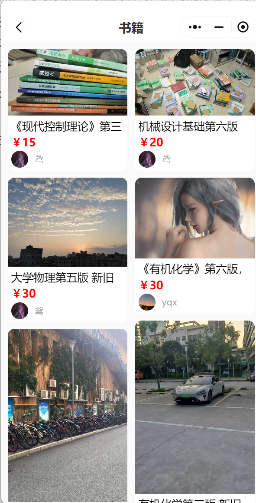

##### 商品详情，用户能够留言，回复，点赞，可以进行购买或联系卖家

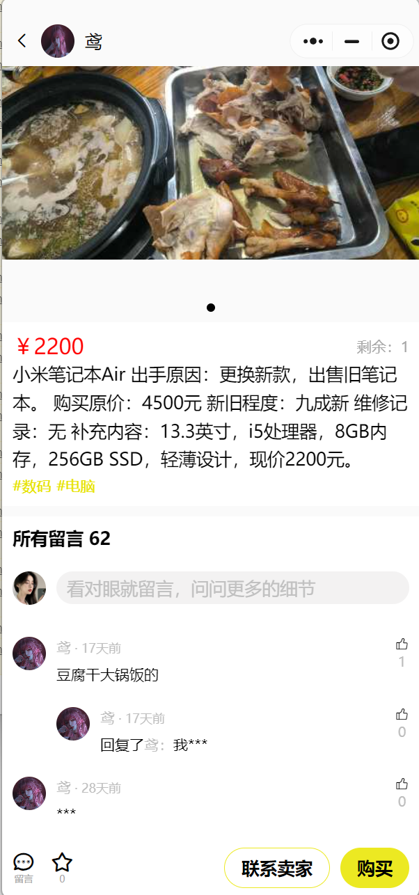

##### 发布商品，需要填写商品描述，上传商品图片，选择分类，填入价格，填写数量(默认为1)

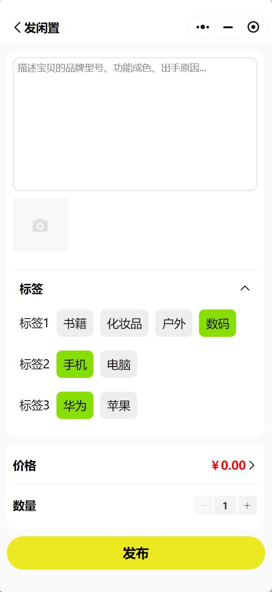

##### 消息主页，包含了与买卖家的聊天消息，订单消息，和评论回复消息

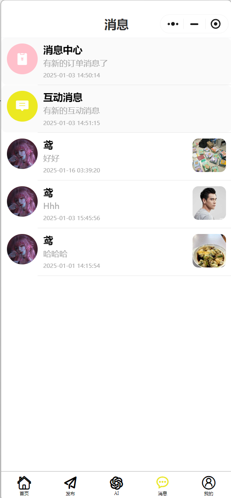

##### 与买卖家的聊天记录

##### 展示近期的互动消息

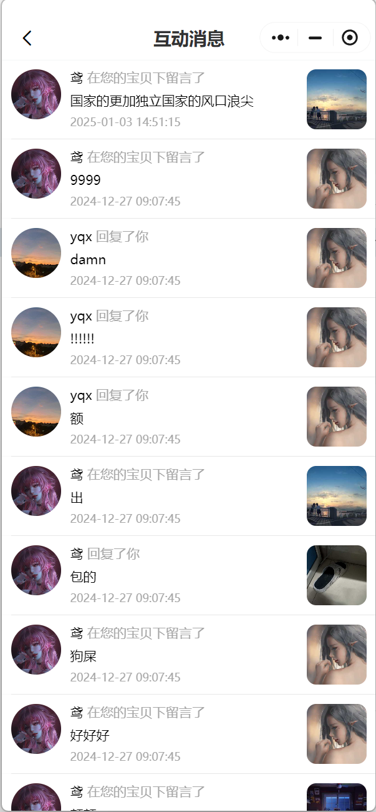

##### 展示近期订单通知消息

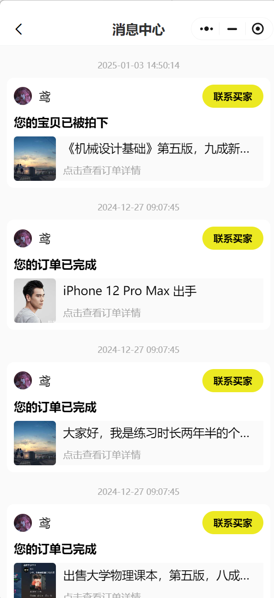

##### 个人功能页面，包括了个人用户发布的商品，已出商品，已买商品，商品收藏，地址

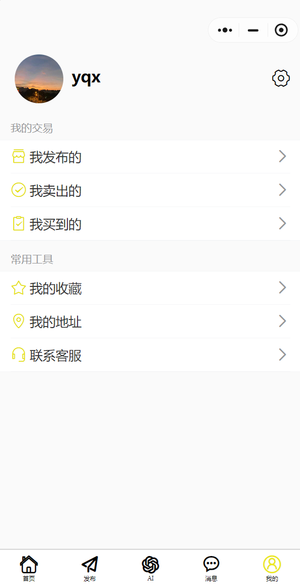

##### 个人主页，展示已出和未出的闲置商品，用户本人能够编辑更改个人资料，包括头像、昵称、简介等

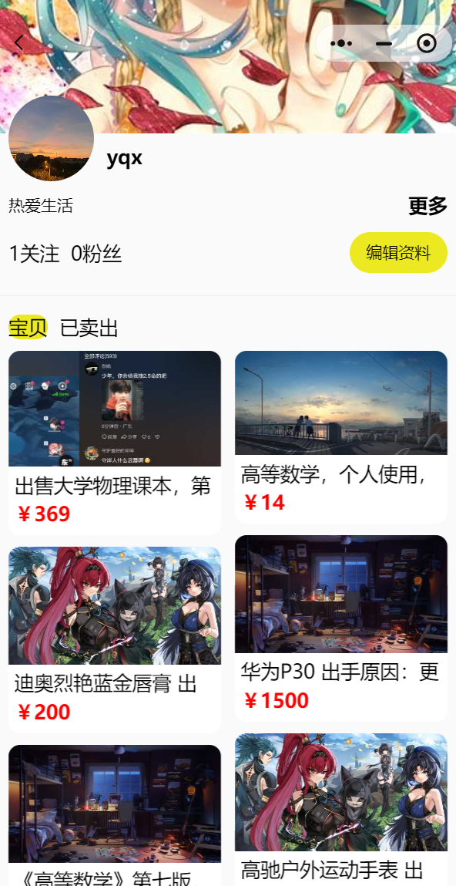

##### 已卖出的商品订单展示，同时显示各个商品订单的状态，包括正在交易中的，订单已取消的，订单完成的

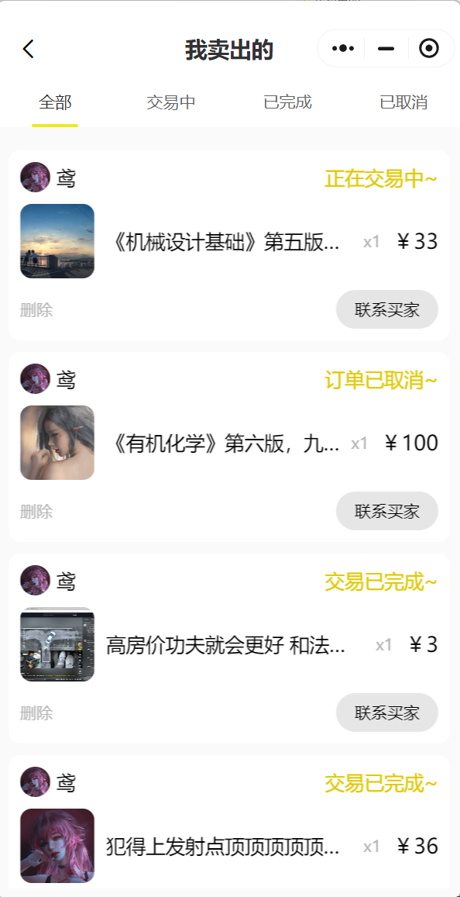

##### 订单详情

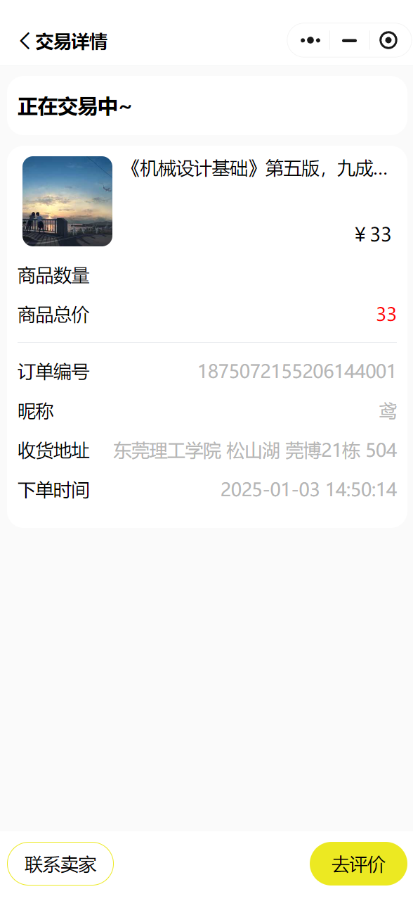

##### 我的收藏展示

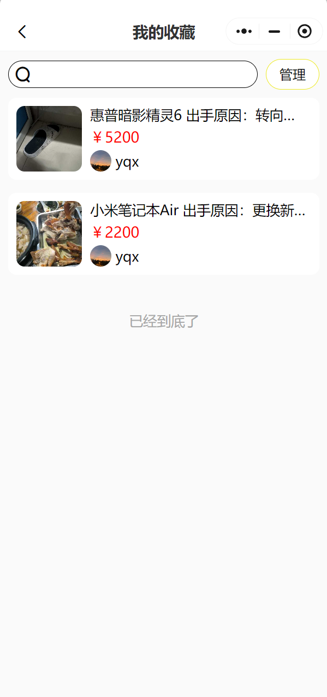

##### 我的地址展示

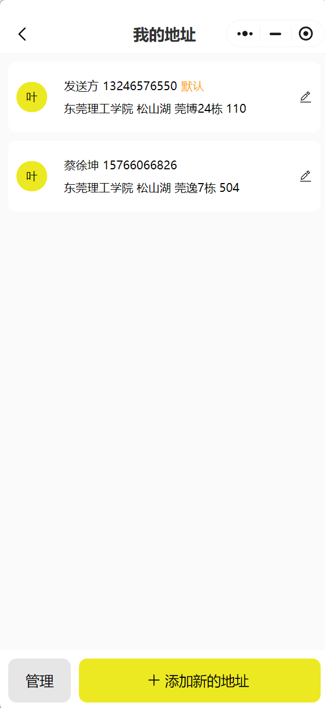

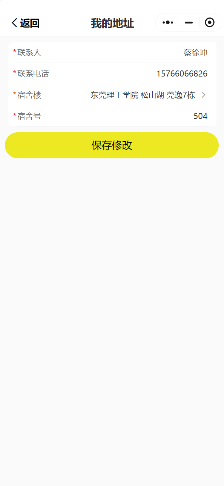

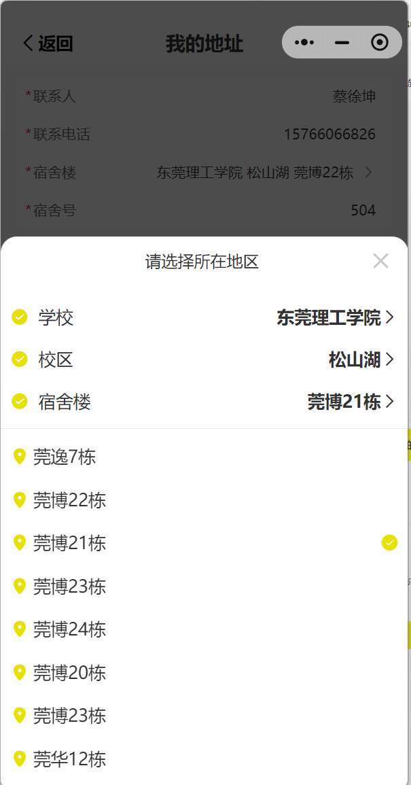

##### ai聊天页面，能够查询以往的聊天记录，进入会话后与ai以聊天形式为自己检索想要的商品

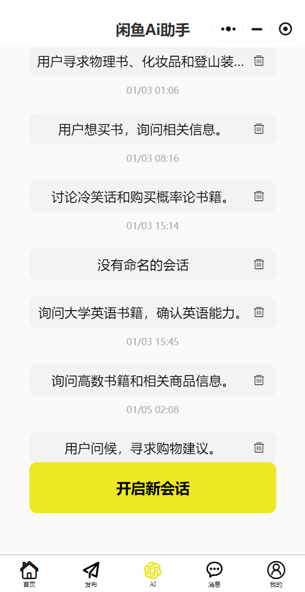

